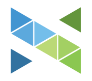
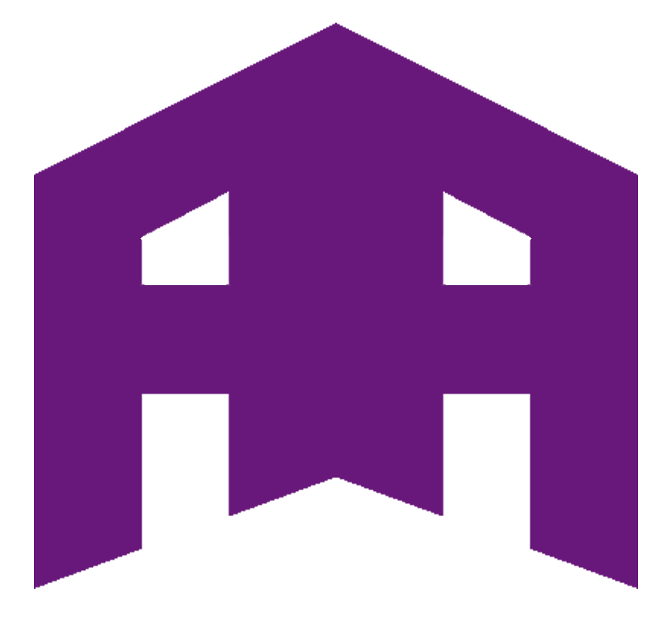

<h1 align=center > Hello there , I'm <b>Aadit Agarwal</b></h1>

<h4 align=center >
I am a pre-final year Information Technology student and a Software Engineer focused on growing as a Developer specifically Back-end engineering and broadening my knowledge about Machine Learning.
</h4>

<table align="center">
  <tr>
    <td style="border-right: 1px solid #eeeeef;"> Software Engineering Intern'22 at </a> <a href="https://shipsy.io/">Shipsy</a> </td>
    <td style="border-right: 1px solid #eeeeef;"> Software Engineering Summer Intern'21 at </a> <a href="https://numtra.com/">Numtra Inc.</a> </td>
    <td style="border-right: 1px solid #eeeeef;"> Data Science Winter Intern'20 at </a> <a href="https://www.tealindia.in/">TEAL India</a> </td>
  </tr>
</table>

<h4 align=center >
I love developing solutions on ideas to harness technology for tackling real-time challenges and love to build products which can produce impact at scale.
</h4>

<table align="center">
  <tr>
    <td style="border-right: 1px solid #eeeeef;"> Website: <a href="https://aaditagarwal.in"><b>aaditagarwal.in</b></a></td>
    <td style="border-right: 1px solid #eeeeef;"> LinkedIn: <a href="https://linkedin.com/in/aaditagarwal"><b>/aaditagarwal</b></a></td>
    <td> Mail @ <a href="mailto:agarwal.aadit99@gmail.com"><b>agarwal.aadit99@gmail.com</b></a></td>
  </tr>
</table>

## 🛠 Languages and Tools

  
  
  
  
  
  
  
  
  
  
  
  
  
  
  
  
  

## 🏆 Achievements
- Published [ActiveNet](https://arxiv.org/abs/2010.13714) at [The ACM India Joint International Conference on Data Science and Management of Data 2021](https://cods-comad.in/2021/accepted_papers.html)
  - [Implementation](https://github.com/aaditagarwal/ActiveNet)
- Winner of  [E&Y GDS Radio Hackathon](https://drive.google.com/file/d/15aG-A-nJQrc0axuN79I-MYQay1AIT3Gg/view) - AI in Capacity Management
  - [Solution](https://github.com/aaditagarwal/Fitment-Predictor)
- Winner of [Game of Codes Hackathon](https://codecops.web.app/goc/certificates/IIITUGOC2020012) organized by IIIT, Una - Machine Learning Team
  - [Solution](https://github.com/aaditagarwal/ActiveNet)

## 🏅 My GitHub Stats

 
 <!--  -->

